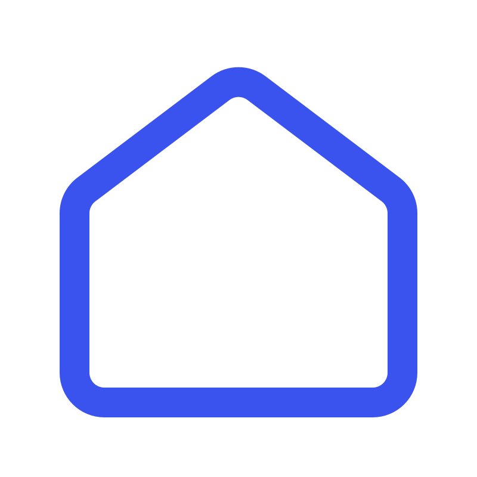

<h1>
  Hey There!!
  
</h1>

<!--

  

-->
### :man_technologist: About Me : 

Hi, I'm Philip!
I'm an Italian Software Engineer :pinched_fingers: driven by curiosity and a passion for deep technical exploration. My journey into the world of computing has turned me into a proud Rustoceans enthusiast 🦀.

As a tech enthusiast, I’m naturally drawn to cutting-edge projects where I can push the boundaries of innovation.

What I Do
⚙️ Low-Level Enthusiast
I enjoy exploring low-level languages and tools. Understanding how things work under the hood fuels my passion for systems programming and performance optimization. Crafting efficient and effective solutions is always my priority.

📐 Architectural Thinker
While I love working close to the metal, I also excel in high-level reasoning. Designing robust architectures and building scalable solutions allows me to merge technical depth with strategic thinking.

⚒️ Pattern Explorer
Software design patterns are my go-to approach for solving complex problems. I believe that applying them thoughtfully creates sustainable, maintainable, and future-proof software.

I'm always eager to collaborate on challenging projects, exchange ideas, and contribute to exciting open-source initiatives. Let’s build something remarkable together!

### Connect with me:

  
  
  

  

### :hammer_and_wrench: My Favorite Languages and Tools :

  &nbsp;
  &nbsp;
  &nbsp;
  &nbsp;
  &nbsp;
  &nbsp;
  &nbsp;
  &nbsp;
  &nbsp;
  

Please, visit my [website](https://philiptamb.github.io)

<!--

   

-->
### :fire: My Stats :

Keep building, keep exploring! 🚀
