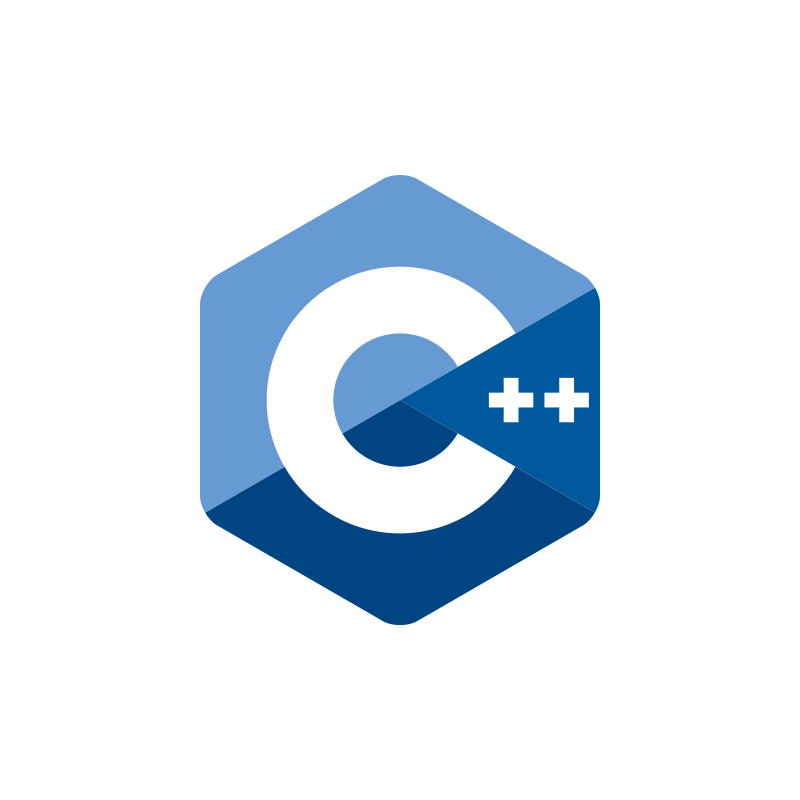

<!-- ### Hi there 👋
**PhilipTamb/PhilipTamb** is a ✨ _special_ ✨ repository because its `README.md` (this file) appears on your GitHub profile.

Here are some ideas to get you started:

- 🔭 I’m currently working on ...
- 🌱 I’m currently learning ...
- 👯 I’m looking to collaborate on ...
- 🤔 I’m looking for help with ...
- 💬 Ask me about ...
- 📫 How to reach me: ...
- 😄 Pronouns: ...
- ⚡ Fun fact: ...
-->

<h1>
  Hey There!!
  
</h1>

<!--

  

### ---
-->
### :man_technologist: About Me :

I'm Philip, a passionate Software Engineer driven by curiosity and a love for deep technical exploration. My path into the world of computing has led me to become a  Rustoceans enthusiast  🦀

What I Do

- 	:mortar_board:   Low-Level Enthusiast: I enjoy diving into the depths of low-level languages and tools. Understanding how things work under the hood fuels my passion for systems programming and performance optimization.

- 	:mortar_board:   Architectural Thinker: While I love working close to the metal, I also thrive in high-level reasoning. Designing robust architectures and crafting scalable solutions is where I merge technical depth with strategic thinking.

- 	:mortar_board:   Pattern Explorer: Software design patterns are my go-to for solving complex problems. I believe that well-applied patterns are the foundation of sustainable and maintainable software.

Why Connect?

I'm always eager to collaborate on challenging projects, exchange ideas, and contribute to exciting open-source initiatives. Let's build something remarkable together!

### :hammer_and_wrench: My Favorite Languages and Tools :

  &nbsp;
  &nbsp;
  &nbsp;
  &nbsp;
  &nbsp;
  &nbsp;
  &nbsp;
  &nbsp;
  &nbsp;
  

Please, visit my website --> https://philiptamb.github.io

  
  
  

  

### :fire: My Stats :

Keep building, keep exploring! 🚀
